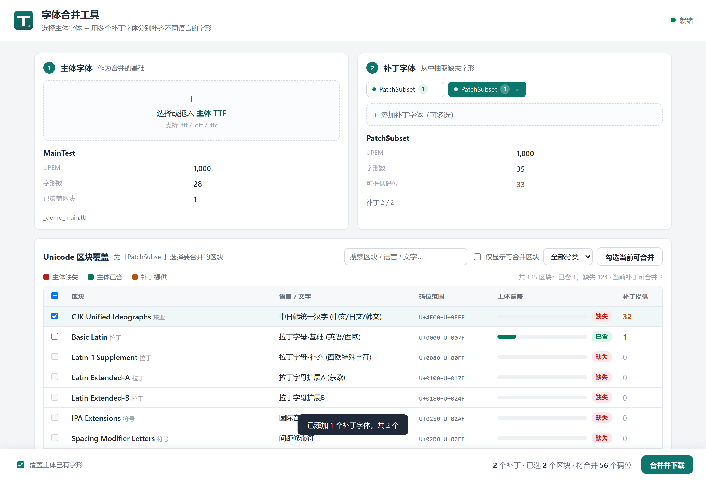

# TTF Font Merger

[English](./README.md) | [简体中文](./README.zh-CN.md)

Merge glyph coverage from multiple TrueType fonts into a single master font — with automatic UPEM scaling, Unicode block detection, and composite-glyph support.


A local tool for font developers and localization engineers. Load a **master font**, see exactly which Unicode blocks and scripts it is missing, then **add multiple patch fonts** and selectively merge only the glyphs you need. Built for the common case where a CJK font (such as SimHei) needs to gain readable Khmer, Tibetan, Thai, and more from Noto fonts — without manual fontTools scripting.



## Features

- **Unicode block analysis** — 125 blocks with coverage statistics, script names, and human-readable language labels
- **Multi-font merge** — add any number of patch fonts in one session; each gets its own tab with independent block selection
- **Automatic UPEM scaling** — glyphs from a 1000-UPEM patch font are correctly scaled into a 2048-UPEM master (no more tiny glyphs)
- **Composite glyph support** — components referenced by composite glyphs are pulled in recursively
- **Overwrite control** — choose whether patch glyphs replace the master's existing glyphs in a block, or only fill gaps
- **Conflict resolution** — when multiple patches cover the same codepoint, the first-added patch wins
- **Two run modes** — standalone desktop app (native window, no browser needed) or classic web UI for development
- **Self-contained** — fontTools is bundled in `libs/`; zero `pip` installs to run from source

## Table of Contents

- [Quick Start](#quick-start)
- [Usage](#usage)
- [How It Works](#how-it-works)
- [Build from Source](#build-from-source)
- [Testing](#testing)
- [Project Structure](#project-structure)
- [Limitations](#limitations)
- [FAQ](#faq)
- [Contributing](#contributing)
- [License](#license)

## Quick Start

### Desktop app (recommended)

Download `TtfMergeTool.exe` from the [Releases](../../releases) page and double-click it. The app opens its own window — no Python, no browser, no installation required.

> Requires Windows 10/11 with the WebView2 Runtime (pre-installed on most modern systems).

### Run from source

```powershell
git clone https://github.com/flame-34/ttf-font-merger.git
cd ttf-font-merger
python desktop.py
```

`fontTools` is already bundled in `libs/`, so no `pip install` is needed.

## Usage

1. **Load the master font** — drag in or select a `.ttf`. The table shows coverage per Unicode block: missing or present, codepoint counts, and associated scripts and languages.
2. **Add patch fonts** — click "Add patch font" to add one or more `.ttf` files at once. Each patch becomes a tab showing how many codepoints it can supply.
3. **Select blocks per patch** — click a tab to switch to that font, then check the blocks you want to merge from it. Assign different blocks to different patches (for example, one for Khmer, one for Tibetan, one for Thai). Use the search box and category filter to find blocks quickly.
4. **Merge** — click the merge button to fold all selected blocks into the master in a single pass. The status bar tracks patch count, selected blocks, and total codepoints in real time. When patches overlap on the same codepoint, the first-added patch wins.
5. **Overwrite toggle** — enabled by default. When the master already has (for example, undersized) glyphs in a block you are patching, this replaces them with the patch's glyphs. Turn it off to only fill codepoints the master lacks entirely.

## How It Works

The merge engine (in `fontlib.py`) is built on fontTools and works as follows:

1. **Coverage analysis** — the master font's `cmap` (via `getBestCmap`) is scanned against the built-in Unicode block dataset. Each block is marked missing/present with a coverage fraction.
2. **UPEM scaling** — when the master and patch have different `unitsPerEm` values, a scale factor `main.upem / patch.upem` is computed. All glyph coordinates, composite offsets, and horizontal/vertical metrics are multiplied by this factor and rounded with `otRound`, so a 1000-UPEM glyph lands at the right size in a 2048-UPEM font.
3. **Glyph copying** — each target glyph is deep-copied from the patch and given a unique name (suffixed to avoid collisions). Composite glyphs pull in their referenced components recursively, and bounding boxes are recomputed.
4. **Multi-patch chaining** — patches are applied in order to the same in-memory master font. A codepoint already supplied by an earlier patch is skipped by later ones, giving deterministic first-patch-wins behavior.
5. **Table integrity** — `maxp.numGlyphs` is updated, the `cmap` is rewritten across all subtables, and the `post` table is rebuilt (format-3 source fonts are converted to format 2.0 with reconstructed glyph-name metadata).

## Build from Source

To package a standalone `.exe`:

1. Install the build dependencies into `libs/`:

```powershell
python -m pip install --target=libs pywebview pyinstaller
```

2. Run the build script:

```powershell
build.bat
```

The single-file `dist\TtfMergeTool.exe` (~18 MB) is generated. The `PYTHONNOUSERSITE=1` flag in `build.bat` is important — without it, PyInstaller pulls in unrelated global packages (torch, numpy) and the bundle bloats past 200 MB.

To run the web-only mode for development:

```powershell
python server.py
```

Then open `http://127.0.0.1:8765/` (set `PORT` to change the port; add `--no-browser` to skip auto-opening).

## Testing

```powershell
python _smoke.py
```

This covers font analysis, UPEM scaling, multi-patch chaining, and overlap resolution without needing a server.

For the HTTP API, start the server in one terminal and run:

```powershell
python server.py --no-browser
python _http_smoke.py
```

The tests synthesize two minimal fonts with fontBuilder (a Latin-only master and a patch with Greek/Cyrillic/CJK plus a composite glyph) and verify the full pipeline.

## Project Structure

```text
.
├── server.py            # HTTP server + JSON API (stdlib http.server)
├── fontlib.py           # Font analysis + glyph merging (fontTools)
├── unicode_blocks.py    # Unicode block dataset (125 blocks w/ language labels)
├── desktop.py           # Desktop window launcher (pywebview + WebView2)
├── build.bat            # One-click exe packaging script
├── app.ico              # Application icon (multi-resolution)
├── static/
│   ├── index.html       # Single-page UI
│   ├── app.js           # Frontend logic (multi-patch state management)
│   ├── style.css        # Styling
│   └── icon.svg         # Vector app icon
├── libs/                # Bundled fontTools (gitignored, see build steps)
├── docs/images/         # Screenshots
├── _smoke.py            # Logic tests
└── _http_smoke.py       # HTTP API tests
```

## Limitations

- **TrueType (glyf) outlines only.** CFF/OTF outlines are detected and reported with a clear message, but not merged.
- **Windows desktop.** The packaged app uses the WebView2 runtime. The web UI works on any platform with Python 3.8+.
- **TTC collections.** Only the first face in a `.ttc` is read.
- **Merge produces a new file.** Original font files are never modified.

## FAQ

**Can I merge OTF fonts?**
No — only TrueType (`.ttf`) fonts with `glyf` outlines are supported. The tool detects CFF outlines and tells you.

**The merged glyphs look too small. Why?**
This happens when UPEM differs and is exactly what the automatic scaling fixes. If you still see it, make sure you are not loading an old merge result as the master.

**Can multiple patches cover the same block?**
Yes. The first-added patch supplies its glyphs first; later patches skip codepoints already taken.

**Does it modify my original fonts?**
No. The merge always produces a new `_merged.ttf` file.

## Contributing

Issues and pull requests are welcome. Please run the test suite before submitting:

```powershell
python _smoke.py
```

## License

[MIT](./LICENSE)
